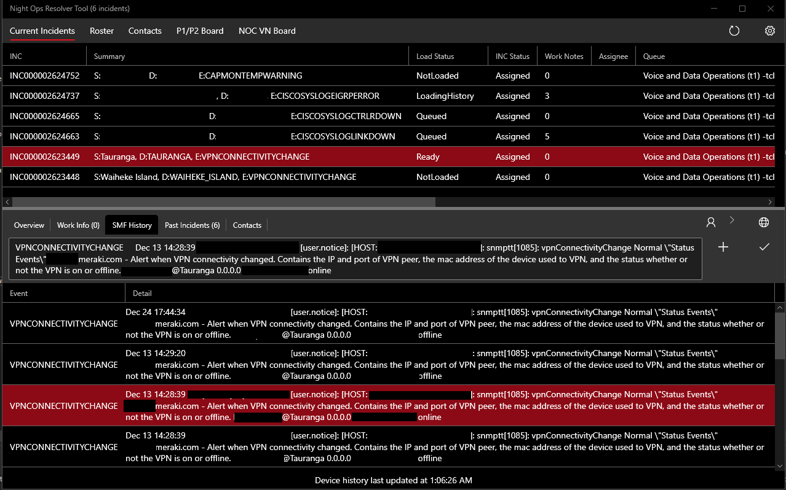
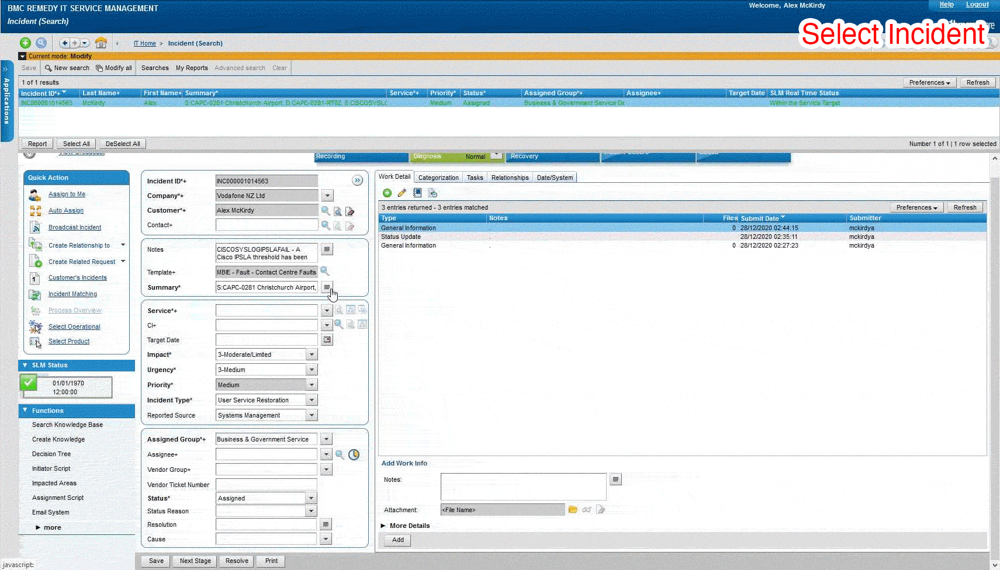
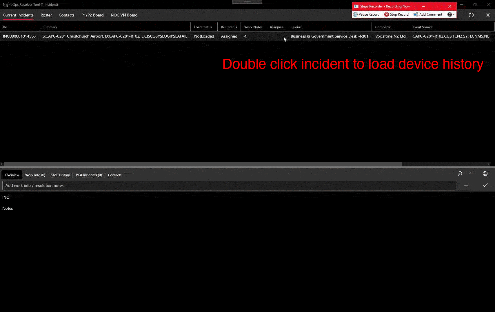
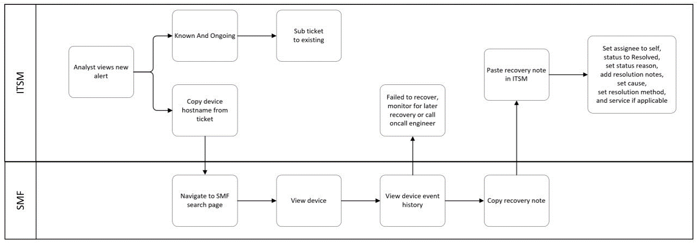
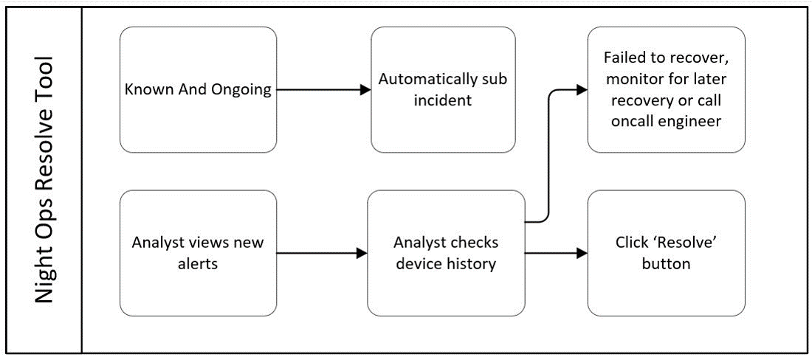

# Night Ops Resolver Tool

This project was an internal tool to act as a single point of contact between our ticketing system (BMC Remedy / ITSM) and our internal device monitoring site. 

This repository has been sanitised of identifying information and code and will not compile as is, full unsanitised repo remains with the company.

## Context

To manage high priority incidents, a search query is run in ITSM to see P1/P2 alerts, which are either active incidents under investigation, or alerts raised by our device monitoring tool which need further investigation (ie: a ping fail could be power down at a site, or a network fault).

The existing process requires a large amount of manual data entry:

This project acts as a single point of contact for these two sites, prefetches the device history as needed, and reduces the amount of manual work to enter data and resolve tickets:

Or, comparing the two processes as diagrams:

### Existing Workflow

### Revised Workflow

## Extra Features

For high-priority management, we also have integration in with the on call engineer roster, browser tabs showing the intranet's priority incident dashboard, and a set of contacts (engineers / service desks / service delivery managers) which are crossreferenced with each incident.

The features which I was unable to implement due to requiring work on the ITSM API from another stakeholder were subbing incidents, viewing service level agreements, and placing incidents in to a 'pending' state. The workflow diagram above represents the ideal state, and the existing ITSM site is still available for any tasks which can't be completed in Night Ops Resolver Tool.

## Project Architecture

`NoResolver.Core` is a shared library. It connects to ITSM via the SOAP API provided by BMC Remedy, scrapes the HTML from SMF's device history, and performs all that can be done without a UI.

`NoResolver.WPF` is a Windows Presentation Foundation (WPF) application, using the ModernWPF library for style purposes, and the Prism library to follow the MVVM architecture pattern. An Universal Windows Platform application was the initial plan, but became infeasible for distribution reasons.

`NoResolver.OnCall` is a shared library dedicated to the NOC oncall roster - was a bit too disparate to keep in Core

`NoResolver.CLI` is handy for testing new endpoints

An extended description of the project and its files / architecture is available in the wiki.

## Licence

This repository has been sanitised of company information and released under a MIT licence.

Please note that this project will not run without a reasonable amount of modification, as it's connected to endpoints which are only accessible via intranet, and the links to these endpoints have been removed.

## What's been removed?

Couple of things, most have been marked with the comment `/* REMOVED (- comment) */`

Use `rgrep REMOVED` in a CLI to see a summary

* Hostnames of intranet sites (specifically:)
* Search queries run in BMC Remedy
* WDSL output from BMC Remedy
    * Autogenerated files have been kept, because some modification was required on these files (some fields had to be made nullable)
* Excel doc outlining ITSM Schema and database fields - available at http://www.softwaretoolhouse.com/freebies/index.html
* `assignees.json` and `contacts.csv` - staff names and contacts loaded at runtime
    * N.B. these were not saved within the primary repo in the first place

# (Coming soon: debrief, wiki, user readme, extra branch showing code scaffolding)